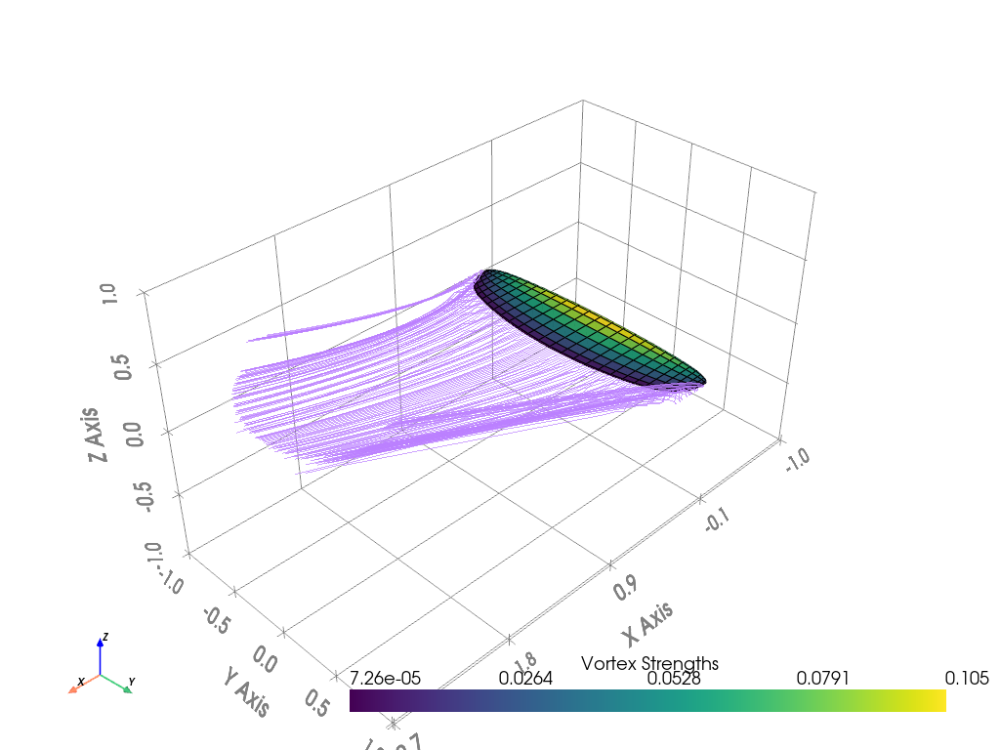

# Experiment Results

**Experiment ID:** `20251023_161603`

**Description:** 'Optimise the chord lengths and angle of attack (within 0 and 30 degrees)to minimise the drag coefficient, with a required lift coefficient of 1.5 and a fixed wing area of 0.9

**Status:** ✅ SUCCESS

## Optimization Variables

```python
chord_list = opti.variable(init_guess=np.array(chord_list))
alpha = opti.variable(init_guess=alpha, lower_bound=0, upper_bound=30)
```

## Constraints and Objective

```python
opti.subject_to([
    chord_list > 0,
    alpha >= 0,
    alpha <= 30,
    aero["CL"] == 1.5,
    main_wing.area() == 0.9
])

opti.minimize(aero["CD"])
```

## Experiment Output

```
✓ Created airplane configuration at: ./plane-definition/airplane.yaml
✓ Created operating point configuration at: ./plane-definition/operating-point.yaml
✓ Created airplane configuration at: ./plane-definition/airplane.yaml
✓ Created operating point configuration at: ./plane-definition/operating-point.yaml
This is Ipopt version 3.14.11, running with linear solver MUMPS 5.4.1.

Number of nonzeros in equality constraint Jacobian...:       33
Number of nonzeros in inequality constraint Jacobian.:       20
Number of nonzeros in Lagrangian Hessian.............:      153

Total number of variables............................:       17
                     variables with only lower bounds:        0
                variables with lower and upper bounds:        0
                     variables with only upper bounds:        0
Total number of equality constraints.................:        2
Total number of inequality constraints...............:       20
        inequality constraints with only lower bounds:       18
   inequality constraints with lower and upper bounds:        0
        inequality constraints with only upper bounds:        2

iter    objective    inf_pr   inf_du lg(mu)  ||d||  lg(rg) alpha_du alpha_pr  ls
   0  7.5669222e-03 1.28e+00 4.82e-01   0.0 0.00e+00    -  0.00e+00 0.00e+00   0
   1  2.0894837e-01 1.04e-01 3.90e+01  -5.6 2.71e+01    -  1.54e-01 9.12e-01h  1
   2  1.6994611e-01 5.66e-02 6.93e+01  -6.4 8.34e-01    -  2.28e-01 1.00e+00h  1
   3  1.7319860e-01 6.62e-03 3.26e+02  -1.5 3.26e-02   4.0 1.00e+00 1.00e+00h  1
   4  1.7380280e-01 8.32e-05 2.99e+01  -3.1 3.56e-03   3.5 1.00e+00 1.00e+00h  1
   5  1.7380988e-01 1.68e-08 8.81e-02  -5.0 5.44e-05   3.0 1.00e+00 1.00e+00h  1
   6  1.7380861e-01 1.75e-09 7.00e-03  -6.9 1.89e-05   2.6 1.00e+00 1.00e+00h  1
   7  1.7380482e-01 1.57e-08 6.99e-03  -9.0 5.66e-05   2.1 1.00e+00 1.00e+00h  1
   8  1.7379344e-01 1.41e-07 6.99e-03 -11.0 1.70e-04   1.6 1.00e+00 1.00e+00h  1
   9  1.7375936e-01 1.26e-06 6.99e-03 -11.0 5.10e-04   1.1 1.00e+00 1.00e+00h  1
iter    objective    inf_pr   inf_du lg(mu)  ||d||  lg(rg) alpha_du alpha_pr  ls
  10  1.7365765e-01 1.11e-05 6.99e-03 -11.0 1.53e-03   0.7 1.00e+00 1.00e+00h  1
  11  1.7335687e-01 9.33e-05 6.99e-03 -11.0 4.59e-03   0.2 1.00e+00 1.00e+00h  1
  12  1.7248591e-01 7.08e-04 6.95e-03 -11.0 1.37e-02  -0.3 1.00e+00 1.00e+00h  1
  13  1.7002744e-01 4.56e-03 6.43e-03 -11.0 3.80e-02  -0.8 1.00e+00 1.00e+00h  1
  14  1.6317610e-01 2.55e-02 6.66e-03 -11.0 1.18e-01  -1.2 1.00e+00 1.00e+00h  1
  15  1.5814127e-01 3.80e-02 7.36e-03 -11.0 1.82e-01  -1.7 1.00e+00 1.00e+00h  1
  16  1.6332646e-01 3.05e-03 2.71e-03 -11.0 5.40e-02  -1.3 1.00e+00 1.00e+00h  1
  17  1.6270504e-01 9.18e-04 2.57e-03 -11.0 1.54e-01  -1.8 1.00e+00 1.00e+00h  1
  18  1.6054843e-01 2.64e-03 2.00e-03 -11.0 3.59e-01  -2.3 1.00e+00 1.00e+00h  1
  19  1.5225385e-01 2.12e-02 1.98e-03 -11.0 8.77e-01  -2.7 1.00e+00 1.00e+00h  1
iter    objective    inf_pr   inf_du lg(mu)  ||d||  lg(rg) alpha_du alpha_pr  ls
  20  1.2359620e-01 3.27e-01 1.87e-01 -10.3 1.04e+01  -3.2 1.00e+00 9.79e-02h  1
  21  9.2104687e-02 6.50e-01 3.28e-01  -8.8 9.18e+00  -1.9 1.00e+00 4.05e-02h  1
  22  1.0792450e-01 3.76e-01 1.30e-01  -7.3 5.69e-01  -2.4 1.00e+00 1.00e+00h  1
  23  7.9480328e-02 5.80e-01 2.95e-01  -6.2 1.52e+01  -2.8 1.00e+00 5.51e-02h  1
  24  1.1142222e-01 3.19e-01 1.64e-01  -5.7 5.97e-01  -2.4 1.00e+00 1.00e+00h  1
  25  1.3421478e-01 1.92e-01 9.07e-02  -3.9 8.78e-01  -2.9 1.00e+00 1.00e+00h  1
  26  1.1891987e-01 2.96e-01 8.41e-02  -3.1 5.39e+00    -  1.00e+00 9.66e-01f  1
  27  1.4659416e-01 1.00e-01 9.82e-02  -2.8 6.89e+00  -3.4 7.18e-02 1.00e+00h  1
  28  1.5364751e-01 2.83e-02 1.08e-02  -2.8 1.26e-01  -1.1 9.23e-01 1.00e+00h  1
  29  1.5611986e-01 4.62e-03 6.82e-03  -3.0 2.47e-01  -1.6 1.00e+00 1.00e+00h  1
iter    objective    inf_pr   inf_du lg(mu)  ||d||  lg(rg) alpha_du alpha_pr  ls
  30  1.5620373e-01 2.47e-03 1.66e-03  -3.9 4.92e-01    -  9.87e-01 1.00e+00h  1
  31  1.4927144e-01 3.17e-02 5.96e-03  -4.5 6.80e+00    -  1.00e+00 1.00e+00h  1
  32  1.5414421e-01 1.07e-02 4.07e-02  -4.3 2.59e-01  -1.2 1.00e+00 1.00e+00h  1
  33  1.5504511e-01 2.51e-03 1.13e-02  -4.6 2.27e-01  -1.7 1.00e+00 1.00e+00h  1
  34  1.5353092e-01 1.31e-02 1.08e-02  -4.4 2.99e-01  -2.1 1.00e+00 1.00e+00h  1
  35  1.5522134e-01 1.20e-03 1.21e-02  -5.1 7.71e-02  -0.8 1.00e+00 1.00e+00h  1
  36  1.5533000e-01 6.79e-06 4.38e-03  -7.0 1.02e-02  -0.4 1.00e+00 1.00e+00h  1
  37  1.5522942e-01 1.75e-03 3.40e-02  -7.2 1.96e-01  -0.9 1.00e+00 1.00e+00h  1
  38  1.5537676e-01 2.98e-05 3.78e-03  -7.3 3.14e-02  -1.3 1.00e+00 1.00e+00h  1
  39  1.5527018e-01 7.23e-06 2.52e-03  -7.3 2.04e-02  -0.9 1.00e+00 1.00e+00h  1
iter    objective    inf_pr   inf_du lg(mu)  ||d||  lg(rg) alpha_du alpha_pr  ls
  40  1.5485049e-01 2.41e-04 3.31e-03  -8.6 8.04e-02  -1.4 1.00e+00 1.00e+00h  1
  41  1.5464324e-01 9.33e-04 1.07e-02 -10.0 7.57e-02  -1.9 1.00e+00 1.00e+00h  1
  42  1.5462163e-01 6.36e-05 7.33e-03  -9.4 2.38e-02  -0.5 1.00e+00 1.00e+00h  1
  43  1.5133230e-01 1.26e-02 8.32e-03  -7.7 1.24e+00    -  1.00e+00 9.39e-01h  1
  44  1.5352440e-01 8.67e-04 4.42e-03  -8.7 1.88e-01    -  1.00e+00 1.00e+00h  1
  45  1.5348254e-01 5.60e-04 1.20e-03  -8.8 4.03e-02    -  1.00e+00 1.00e+00h  1
  46  1.5356575e-01 9.12e-05 1.08e-04  -9.6 1.56e-02    -  1.00e+00 1.00e+00h  1
  47  1.5358403e-01 1.03e-06 2.10e-06 -11.0 1.76e-03    -  1.00e+00 1.00e+00h  1
  48  1.5358424e-01 1.18e-10 7.08e-10 -11.0 1.94e-05    -  1.00e+00 1.00e+00h  1

Number of Iterations....: 48

                                   (scaled)                 (unscaled)
Objective...............:   1.5358424326195627e-01    1.5358424326195627e-01
Dual infeasibility......:   7.0757474315494284e-10    7.0757474315494284e-10
Constraint violation....:   1.1843770408859200e-10    1.1843770408859200e-10
Variable bound violation:   0.0000000000000000e+00    0.0000000000000000e+00
Complementarity.........:   1.0004131092343047e-11    1.0004131092343047e-11
Overall NLP error.......:   7.0757474315494284e-10    7.0757474315494284e-10


Number of objective function evaluations             = 49
Number of objective gradient evaluations             = 49
Number of equality constraint evaluations            = 49
Number of inequality constraint evaluations          = 49
Number of equality constraint Jacobian evaluations   = 49
Number of inequality constraint Jacobian evaluations = 49
Number of Lagrangian Hessian evaluations             = 48
Total seconds in IPOPT                               = 33.962

EXIT: Optimal Solution Found.
      solver  :   t_proc      (avg)   t_wall      (avg)    n_eval
       nlp_f  |   1.08 s ( 21.95ms)   1.14 s ( 23.16ms)        49
       nlp_g  |   1.09 s ( 22.21ms)   1.15 s ( 23.49ms)        49
  nlp_grad_f  |   2.49 s ( 49.90ms)   2.55 s ( 51.05ms)        50
  nlp_hess_l  |  26.39 s (549.72ms)  26.56 s (553.42ms)        48
   nlp_jac_g  |   2.47 s ( 49.42ms)   2.50 s ( 49.92ms)        50
       total  |  33.57 s ( 33.57 s)  33.97 s ( 33.97 s)         1
Updated YAML files with optimized values
```

## Visualization



