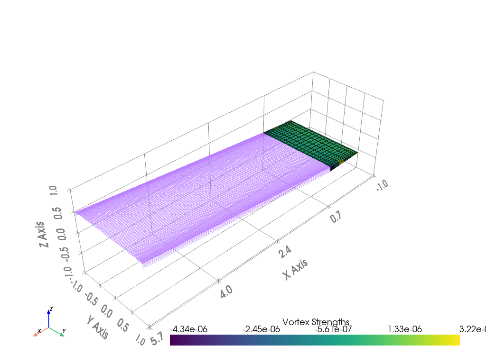

# Experiment Results

**Experiment ID:** `20251023_210926`

**Description:** Optimise the wing twist (incrementally increasing from root to tip) and velocity for maximum lift/drag.

**Status:** ✅ SUCCESS

## Optimization Variables

```python
twist_list = opti.variable(init_guess=np.array(twist_list))
velocity = opti.variable(init_guess=velocity)
```

## Constraints and Objective

```python
opti.subject_to([
    velocity > 0,
    np.diff(twist_list) >= 0
])

opti.maximize(aero["L"] / aero["D"])
```

## Experiment Output

```
✓ Created airplane configuration at: ./plane-definition/airplane.yaml
✓ Created operating point configuration at: ./plane-definition/operating-point.yaml
✓ Created airplane configuration at: ./plane-definition/airplane.yaml
✓ Created operating point configuration at: ./plane-definition/operating-point.yaml
This is Ipopt version 3.14.11, running with linear solver MUMPS 5.4.1.

Number of nonzeros in equality constraint Jacobian...:        0
Number of nonzeros in inequality constraint Jacobian.:       31
Number of nonzeros in Lagrangian Hessian.............:      153

Total number of variables............................:       17
                     variables with only lower bounds:        0
                variables with lower and upper bounds:        0
                     variables with only upper bounds:        0
Total number of equality constraints.................:        0
Total number of inequality constraints...............:       16
        inequality constraints with only lower bounds:       16
   inequality constraints with lower and upper bounds:        0
        inequality constraints with only upper bounds:        0

iter    objective    inf_pr   inf_du lg(mu)  ||d||  lg(rg) alpha_du alpha_pr  ls
   0 -2.9293083e+01 0.00e+00 1.11e+00   0.0 0.00e+00    -  0.00e+00 0.00e+00   0
   1 -3.3497293e+01 0.00e+00 9.34e-01  -1.3 9.22e-01   0.0 1.00e+00 1.00e+00f  1
   2 -6.2998806e+01 0.00e+00 2.31e+00  -1.2 1.35e+01  -0.5 6.61e-02 1.77e-01f  3
   3 -7.3796472e+01 0.00e+00 3.08e+00  -2.1 4.18e-01   0.9 1.00e+00 1.00e+00f  1
   4 -1.1773087e+02 0.00e+00 1.07e+01  -1.3 1.85e+01   0.4 1.00e+00 5.75e-02f  1
   5 -1.6650662e+02 0.00e+00 2.45e+01  -0.4 8.75e+00   0.8 9.87e-01 9.63e-02f  1
   6 -2.0744067e+02 0.00e+00 2.26e+01  -0.6 1.86e+00   1.2 9.98e-01 3.13e-01f  1
   7 -2.3538006e+02 0.00e+00 2.58e+01  -1.0 6.22e-01   1.7 9.99e-01 5.32e-01f  1
   8 -3.1269627e+02 0.00e+00 1.32e+03   0.6 1.35e+02   1.2 6.05e-01 5.75e-03f  1
   9 -4.0530167e+02 0.00e+00 5.22e+01   0.4 1.45e+00   1.6 1.00e+00 5.06e-01f  1
iter    objective    inf_pr   inf_du lg(mu)  ||d||  lg(rg) alpha_du alpha_pr  ls
  10 -4.8063033e+02 0.00e+00 5.40e+01  -0.3 4.65e-01   2.0 9.98e-01 1.00e+00f  1
  11 -5.3232762e+02 0.00e+00 3.31e+02   0.0 6.47e+00   1.6 1.00e+00 5.26e-02f  1
  12 -6.7693002e+02 0.00e+00 1.27e+02  -0.4 7.39e-01   2.0 1.00e+00 1.00e+00f  1
  13 -8.3360945e+02 0.00e+00 1.50e+02  -1.6 5.66e-01   2.4 1.00e+00 8.41e-01f  1
  14 -9.5960655e+02 0.00e+00 1.87e+02  -2.5 2.78e-01   2.8 1.00e+00 1.00e+00f  1
  15 -1.1071604e+03 0.00e+00 1.46e+03   0.4 3.61e+00   2.4 1.00e+00 8.28e-02f  1
  16 -1.1188047e+03 0.00e+00 2.98e+02  -0.4 4.10e-01   2.8 1.00e+00 7.04e-02f  1
  17 -1.8608020e+03 0.00e+00 2.48e+03  -0.6 1.97e+00   2.3 1.00e+00 1.00e+00f  1
  18 -1.9115538e+03 0.00e+00 1.03e+04   1.4 8.73e+01    -  5.52e-01 6.26e-02f  1
  19 -3.0112134e+03 0.00e+00 9.80e+03   1.9 6.20e+02    -  8.49e-01 9.29e-02f  1
iter    objective    inf_pr   inf_du lg(mu)  ||d||  lg(rg) alpha_du alpha_pr  ls
  20 -3.0856486e+03 0.00e+00 3.03e+04   1.9 3.94e+03    -  8.77e-01 4.70e-02f  2
  21 -3.0980073e+03 0.00e+00 5.37e+02   1.9 2.51e+04    -  9.93e-01 1.00e+00f  1
  22 -3.2300669e+03 0.00e+00 1.35e+02   0.4 2.79e+03    -  1.00e+00 1.00e+00f  1
  23 -3.2578028e+03 0.00e+00 2.77e+01  -0.5 8.64e+03    -  1.00e+00 1.00e+00f  1
  24 -3.2644282e+03 0.00e+00 6.62e+00  -1.1 1.59e+04    -  1.00e+00 1.00e+00f  1
  25 -3.2661315e+03 0.00e+00 1.54e+00  -2.2 4.02e+03    -  1.00e+00 1.00e+00f  1
  26 -3.2663985e+03 0.00e+00 1.12e+00  -1.6 1.41e+05    -  9.94e-01 1.00e+00f  1
  27 -3.2666095e+03 0.00e+00 1.07e-01  -2.7 8.87e+03    -  1.00e+00 1.00e+00f  1
  28 -3.2666493e+03 0.00e+00 1.72e-01  -3.3 2.29e+04    -  1.00e+00 9.97e-01f  1
  29 -3.2666589e+03 0.00e+00 7.90e-03  -4.9 1.63e+03    -  1.00e+00 1.00e+00f  1
iter    objective    inf_pr   inf_du lg(mu)  ||d||  lg(rg) alpha_du alpha_pr  ls
  30 -3.2666594e+03 0.00e+00 7.03e+00  -4.0 5.31e+05    -  9.87e-01 3.08e-01f  1
  31 -3.2666618e+03 0.00e+00 7.08e-02  -5.8 1.44e+03    -  9.74e-01 1.00e+00f  1
  32 -3.2666620e+03 0.00e+00 3.45e-02 -10.8 2.66e+01    -  9.42e-01 9.76e-01f  1
  33 -3.2666620e+03 0.00e+00 2.16e-04  -8.1 1.44e+03    -  1.00e+00 9.97e-01f  1
  34 -3.2666620e+03 0.00e+00 9.02e-07 -11.0 3.51e+01    -  1.00e+00 1.00e+00f  1
  35 -3.2666620e+03 0.00e+00 7.29e-07 -11.0 5.18e+03    -  1.00e+00 6.42e-01h  1
  36 -3.2666620e+03 0.00e+00 1.40e-06 -11.0 5.40e-09   1.8 1.00e+00 1.00e+00h  1
  37 -3.2666620e+03 0.00e+00 7.90e-07 -11.0 3.98e-04    -  1.00e+00 1.00e+00h  1
  38 -3.2666620e+03 0.00e+00 1.77e-06 -11.0 2.33e-04    -  1.00e+00 1.00e+00h  1
  39 -3.2666620e+03 0.00e+00 8.86e-07 -11.0 4.00e-08   1.3 1.00e+00 1.00e+00h  1
iter    objective    inf_pr   inf_du lg(mu)  ||d||  lg(rg) alpha_du alpha_pr  ls
  40 -3.2666620e+03 0.00e+00 3.37e-06 -11.0 1.24e-03    -  1.00e+00 1.00e+00h  1
  41 -3.2666620e+03 0.00e+00 1.69e-06 -11.0 2.29e-07   0.9 1.00e+00 1.00e+00h  1
  42 -3.2666620e+03 0.00e+00 4.93e-06 -11.0 9.48e-05    -  1.00e+00 2.50e-01h  3
  43 -3.2666620e+03 0.00e+00 2.70e-06 -11.0 7.46e-07   0.4 1.00e+00 1.00e+00h  1
  44 -3.2666620e+03 0.00e+00 1.17e-06 -11.0 1.43e-06  -0.1 1.00e+00 1.00e+00h  1
  45 -3.2666620e+03 0.00e+00 7.70e-06 -11.0 9.47e-05    -  1.00e+00 1.00e+00h  1
  46 -3.2666620e+03 0.00e+00 3.34e-06 -11.0 2.10e-04    -  1.00e+00 1.00e+00h  1
  47 -3.2666620e+03 0.00e+00 5.25e-06 -11.0 6.11e-06  -0.6 1.00e+00 5.00e-01h  2
  48 -3.2666620e+03 0.00e+00 1.63e-06 -11.0 1.52e-04    -  1.00e+00 5.00e-01h  2
  49 -3.2666620e+03 0.00e+00 1.62e-06 -11.0 2.85e-04    -  1.00e+00 1.00e+00h  1
iter    objective    inf_pr   inf_du lg(mu)  ||d||  lg(rg) alpha_du alpha_pr  ls
  50 -3.2666620e+03 0.00e+00 3.65e-06 -11.0 2.36e-04    -  1.00e+00 1.00e+00h  1
  51 -3.2666620e+03 0.00e+00 8.57e-07 -11.0 7.20e-04    -  1.00e+00 2.50e-01h  3
  52 -3.2666620e+03 0.00e+00 1.20e-06 -11.0 6.39e-04    -  1.00e+00 1.00e+00h  1
  53 -3.2666620e+03 0.00e+00 1.54e-06 -11.0 5.68e-04    -  1.00e+00 5.00e-01h  2
  54 -3.2666620e+03 0.00e+00 1.44e-06 -11.0 8.44e-06  -1.0 1.00e+00 5.00e-01h  2
  55 -3.2666620e+03 0.00e+00 1.72e-06 -11.0 9.75e-04    -  1.00e+00 1.00e+00h  1
  56 -3.2666620e+03 0.00e+00 5.75e-07 -11.0 8.58e-06  -1.5 1.00e+00 5.00e-01h  2
  57 -3.2666620e+03 0.00e+00 1.15e-06 -11.0 1.19e-03    -  1.00e+00 5.00e-01h  2
  58 -3.2666620e+03 0.00e+00 7.77e-07 -11.0 5.37e-05  -2.0 1.00e+00 2.50e-01h  3
  59 -3.2666620e+03 0.00e+00 4.81e-07 -11.0 1.05e-04  -2.5 1.00e+00 2.44e-04h 13
iter    objective    inf_pr   inf_du lg(mu)  ||d||  lg(rg) alpha_du alpha_pr  ls
  60 -3.2666620e+03 0.00e+00 3.79e-07 -11.0 1.49e-04  -2.9 1.00e+00 1.00e+00H  1
  61 -3.2666620e+03 0.00e+00 3.12e-07 -11.0 1.04e-04  -2.5 1.00e+00 1.00e+00h  1
  62 -3.2666620e+03 0.00e+00 3.12e-07 -11.0 3.40e-04  -3.0 1.00e+00 6.10e-05h 15
  63 -3.2666620e+03 0.00e+00 1.34e-06 -11.0 3.70e-04  -3.5 1.00e+00 1.25e-01h  4
  64 -3.2666620e+03 0.00e+00 2.91e-07 -11.0 1.85e-03    -  1.00e+00 2.44e-04h 13
  65 -3.2666620e+03 0.00e+00 3.78e-07 -11.0 2.53e-03  -4.0 1.00e+00 1.22e-04h 14

Number of Iterations....: 65

                                   (scaled)                 (unscaled)
Objective...............:  -3.2666620190404146e+03   -3.2666620190404146e+03
Dual infeasibility......:   3.7820477342498993e-07    3.7820477342498993e-07
Constraint violation....:   0.0000000000000000e+00    0.0000000000000000e+00
Variable bound violation:   0.0000000000000000e+00    0.0000000000000000e+00
Complementarity.........:   1.2594238175793187e-11    1.2594238175793187e-11
Overall NLP error.......:   1.3162640319049831e-07    3.7820477342498993e-07


Number of objective function evaluations             = 147
Number of objective gradient evaluations             = 66
Number of equality constraint evaluations            = 0
Number of inequality constraint evaluations          = 147
Number of equality constraint Jacobian evaluations   = 0
Number of inequality constraint Jacobian evaluations = 66
Number of Lagrangian Hessian evaluations             = 65
Total seconds in IPOPT                               = 44.010

EXIT: Solved To Acceptable Level.
      solver  :   t_proc      (avg)   t_wall      (avg)    n_eval
       nlp_f  |   3.24 s ( 22.06ms)   3.42 s ( 23.26ms)       147
       nlp_g  | 628.00us (  4.27us) 522.58us (  3.55us)       147
  nlp_grad_f  |   3.33 s ( 49.64ms)   3.40 s ( 50.69ms)        67
  nlp_hess_l  |  36.53 s (561.98ms)  37.12 s (571.01ms)        65
   nlp_jac_g  | 491.00us (  7.33us) 490.17us (  7.32us)        67
       total  |  43.17 s ( 43.17 s)  44.02 s ( 44.02 s)         1
Updated YAML files with optimized values
```

## Visualization



