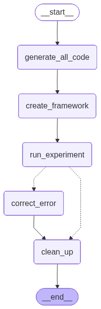
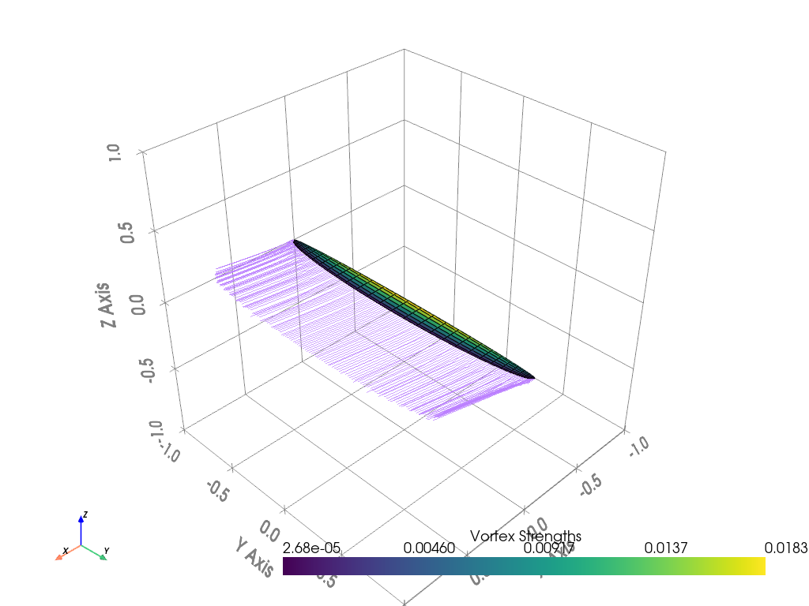

# Experiment Results

**Experiment ID:** `20251024_143333`

**Description:** 'Optimise the chord lengths and angle of attack (within 0 and 30 degrees)to minimise the drag coefficient, with a required lift coefficient of 1,a fixed wing area of 0.25 and monotonically decreasing chord lengths from root to tip.'

**Status:** ✅ SUCCESS

## Workflow



## Optimization Variables

```python
chord_list = opti.variable(init_guess=np.array(chord_list))
alpha = opti.variable(init_guess=alpha, lower_bound=0, upper_bound=30)
```

## Constraints and Objective

```python
opti.subject_to([
    chord_list > 0,
    np.diff(chord_list) <= 0,
    main_wing.area() == 0.25,
    aero["CL"] == 1,
    alpha >= 0,
    alpha <= 30
])

opti.minimize(aero["CD"])
```

## Experiment Output

```
✓ Created airplane configuration at: ./plane-definition/airplane.yaml
✓ Created operating point configuration at: ./plane-definition/operating-point.yaml
✓ Created airplane configuration at: ./plane-definition/airplane.yaml
✓ Created operating point configuration at: ./plane-definition/operating-point.yaml
This is Ipopt version 3.14.11, running with linear solver MUMPS 5.4.1.

Number of nonzeros in equality constraint Jacobian...:       33
Number of nonzeros in inequality constraint Jacobian.:       50
Number of nonzeros in Lagrangian Hessian.............:      153

Total number of variables............................:       17
                     variables with only lower bounds:        0
                variables with lower and upper bounds:        0
                     variables with only upper bounds:        0
Total number of equality constraints.................:        2
Total number of inequality constraints...............:       35
        inequality constraints with only lower bounds:       18
   inequality constraints with lower and upper bounds:        0
        inequality constraints with only upper bounds:       17

iter    objective    inf_pr   inf_du lg(mu)  ||d||  lg(rg) alpha_du alpha_pr  ls
   0  7.5669222e-03 1.75e+00 4.52e-01   0.0 0.00e+00    -  0.00e+00 0.00e+00   0
   1  6.5182490e-02 8.12e-01 4.96e+01  -1.7 1.48e+01    -  2.50e-01 1.00e+00h  1
   2  5.8099307e-02 7.06e-01 2.16e+02   0.3 9.66e+00    -  5.77e-01 1.23e-01h  1
   3  2.0058117e-02 1.84e-02 1.43e+01  -0.1 8.02e+00    -  9.99e-01 1.00e+00f  1
   4  2.0793439e-02 1.37e-05 3.65e-02  -1.6 2.02e-01    -  1.00e+00 1.00e+00h  1
   5  2.0693288e-02 2.23e-05 1.82e-02  -3.5 1.83e-02    -  9.94e-01 1.00e+00h  1
   6  1.9180105e-02 6.27e-03 1.14e-03  -4.3 2.98e-01    -  1.00e+00 1.00e+00h  1
   7  1.8821148e-02 3.33e-03 8.21e-04  -5.3 4.95e-02    -  1.00e+00 1.00e+00h  1
   8  1.8842709e-02 6.28e-04 1.85e-04  -6.2 1.62e-02    -  1.00e+00 1.00e+00h  1
   9  1.8848006e-02 1.23e-04 4.02e-05  -6.5 7.40e-03    -  1.00e+00 1.00e+00h  1
iter    objective    inf_pr   inf_du lg(mu)  ||d||  lg(rg) alpha_du alpha_pr  ls
  10  1.8849334e-02 2.52e-05 8.64e-06  -7.0 3.50e-03    -  9.99e-01 1.00e+00h  1
  11  1.8849714e-02 4.98e-06 1.67e-06  -7.7 1.69e-03    -  1.00e+00 1.00e+00h  1
  12  1.8849799e-02 9.81e-07 2.75e-07  -8.3 9.61e-04    -  1.00e+00 1.00e+00h  1
  13  1.8849816e-02 1.84e-07 9.00e-08  -8.8 6.12e-04    -  9.96e-01 1.00e+00h  1
  14  1.8849819e-02 4.36e-08 7.38e-09 -11.0 3.16e-04    -  1.00e+00 1.00e+00h  1
  15  1.8849820e-02 4.08e-09 7.06e-10 -11.0 9.65e-05    -  1.00e+00 1.00e+00h  1

Number of Iterations....: 15

                                   (scaled)                 (unscaled)
Objective...............:   1.8849820285901653e-02    1.8849820285901653e-02
Dual infeasibility......:   7.0608301150354436e-10    7.0608301150354436e-10
Constraint violation....:   4.0771032105979543e-09    4.0771032105979543e-09
Variable bound violation:   0.0000000000000000e+00    0.0000000000000000e+00
Complementarity.........:   2.6563998488665238e-10    2.6563998488665238e-10
Overall NLP error.......:   4.0771032105979543e-09    4.0771032105979543e-09


Number of objective function evaluations             = 16
Number of objective gradient evaluations             = 16
Number of equality constraint evaluations            = 16
Number of inequality constraint evaluations          = 16
Number of equality constraint Jacobian evaluations   = 16
Number of inequality constraint Jacobian evaluations = 16
Number of Lagrangian Hessian evaluations             = 15
Total seconds in IPOPT                               = 10.765

EXIT: Optimal Solution Found.
      solver  :   t_proc      (avg)   t_wall      (avg)    n_eval
       nlp_f  | 352.09ms ( 22.01ms) 355.26ms ( 22.20ms)        16
       nlp_g  | 355.46ms ( 22.22ms) 360.61ms ( 22.54ms)        16
  nlp_grad_f  | 841.41ms ( 49.49ms) 848.97ms ( 49.94ms)        17
  nlp_hess_l  |   8.24 s (549.37ms)   8.34 s (555.85ms)        15
   nlp_jac_g  | 834.16ms ( 49.07ms) 838.22ms ( 49.31ms)        17
       total  |  10.64 s ( 10.64 s)  10.77 s ( 10.77 s)         1
Updated YAML files with optimized values
```

## Visualization



